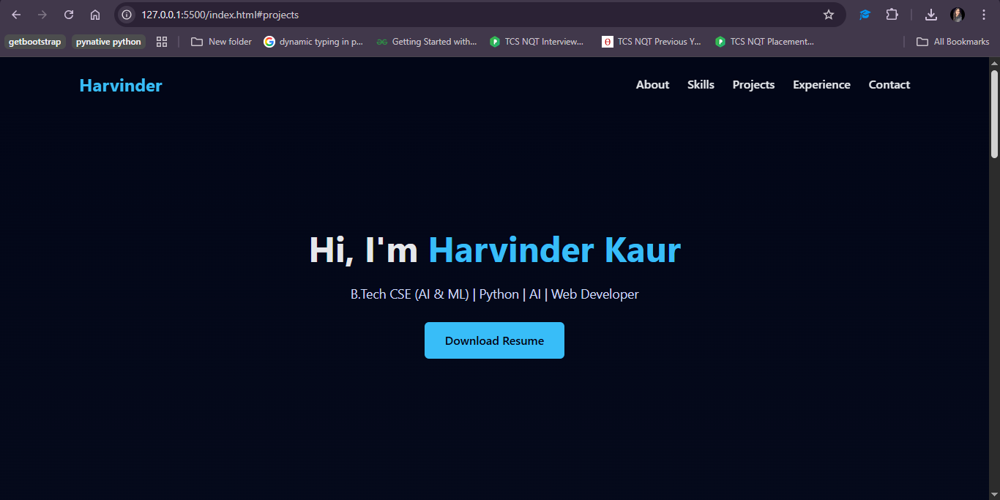

# Harvinder Kaur – Portfolio

This is my **personal portfolio website** built with HTML, CSS, and JavaScript.  
It showcases my skills, projects, experience, and contact details.

---

## 👤 About Me

I am a B.Tech CSE (AI & ML) graduate with hands-on experience in Python, AI projects, web development, and cloud technologies.

---

## 🖼 Portfolio Preview

Here’s a screenshot of my portfolio:




---

## 📂 Project Structure

```text
harvinder-portfolio/
│
├── index.html
├── css/
│   └── style.css
├── js/
│   └── script.js
└── assets/
    ├── images/
    │   ├── profile.jpg
    │   └── portfolio-preview.png
    └── resume/
        └── Harvinder_Kaur_Resume.pdf
